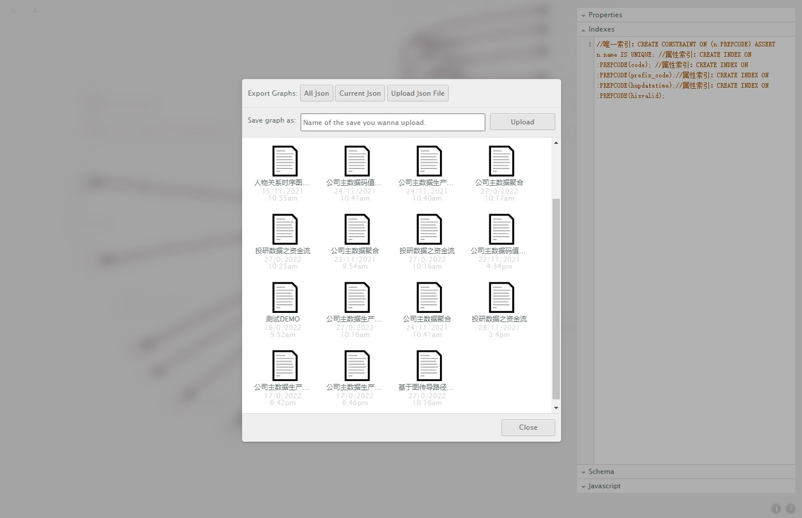

# graphene
>使用cnpm命令启动，速度会更快
1. git clone https://github.com/ongdb-contrib/ongdb-graphene.git
2. cd browser
3. npm install
4. npm start 【cnpm start\cnpm run serve\cnpm run build】
5. open http://localhost:8080/app/

## introduction
>图数据模型设计工具




- 测试用管理员秘钥
```
a399f5a3-8751-491a-bd69-be7c94ec39e2
```

