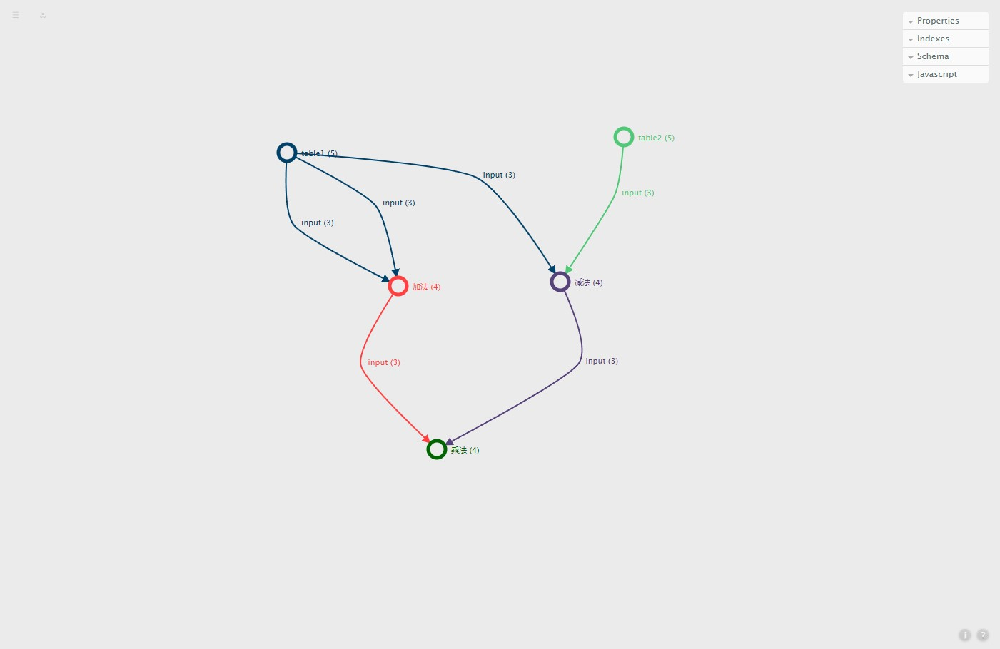
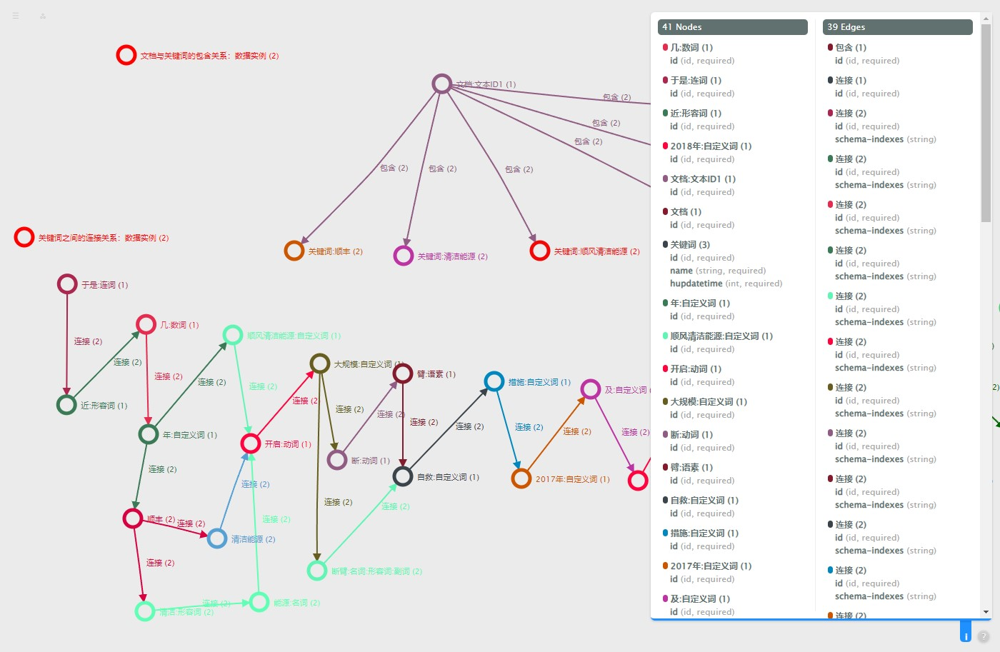
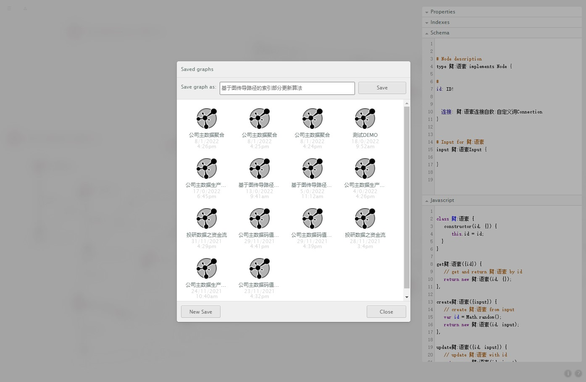

# Graphene
>Graphene是一个可视化WEB端工具，主要做属性图数据建模、图结构设计！

## 谁可以使用它？
>图数据工程师、算法工程师、数据内容工程师，其它需要用图的思维模式来做事情的小伙伴！

## 核心功能
1. 图结构与属性图设计
2. 图数据模型上传下载与导出
3. 图数据模型协作与分享
4. 数据任务ID生成
5. GraphQL/Cypher/Javascript等查询或接口代码的自动生成

## Introduction
>[图数据模型设计工具](https://ongdb-contrib.github.io/graphene/demo.html)








- 测试用管理员秘钥
```
a399f5a3-8751-491a-bd69-be7c94ec39e2
```

## 部署环境
1. git clone https://github.com/ongdb-contrib/graphene.git
2. cd graphene
3. npm install
4. npm run-script build
5. npm start
6. open http://localhost:8080/app/

### Dockerfile
- 在graphene目录下创建Dockerfile文件，打包前端docker镜像即可
```
# 解压graphene.7z，安装docker直接打包即可
FROM node:14.15.1-stretch
ENV NODE_ENV development
# Add a work directory
WORKDIR /graphene
# Cache and Install dependencies
COPY . .
RUN chmod +777 ./node_modules/.bin/webpack
RUN chmod +777 ./node_modules/.bin/webpack-dev-server
#COPY package.json .
RUN npm install
RUN npm run-script build
# Copy app files
# Expose port
EXPOSE 8080
# Start the app
CMD [ "npm", "start" ]
```

- 打包docker镜像
```
sudo docker build -t graphene:v-1.0.0 .
```
- 查看镜像
```
sudo docker images
```
- 运行镜像
```
sudo docker run -p 8080:8080 graphene:v-1.0.0
```
- 查看docker容器中启动的进程
```
sudo docker ps
```
- 对镜像设置TAG
```
sudo docker tag graphene:v-1.0.0 localhost/model/graphene:v-1.0.0
```
- 提交到镜像服务器
```
sudo docker push localhost/model/graphene:v-1.0.0
```

